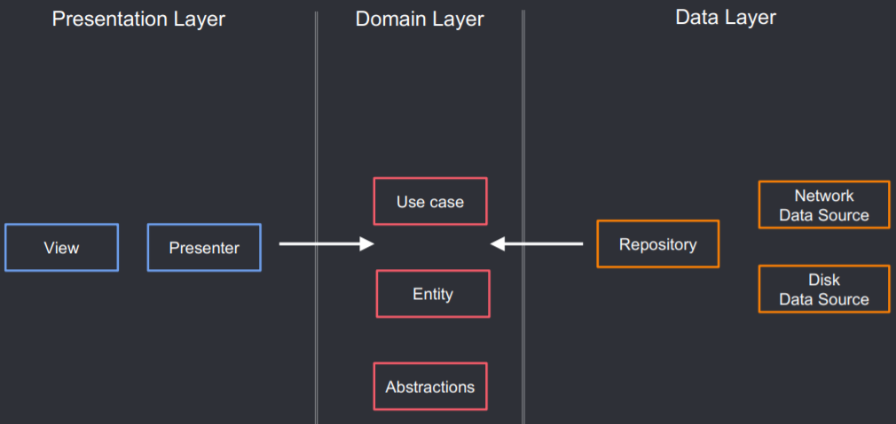

<h1 align="center">Healthy Times</h1>
<div align="center">
  
</div>

Healthy Times is a native Android app where users can browse through articles provided by the [NYTimes Article Search Api](https://developer.nytimes.com/docs/articlesearch-product/1/overview). 
The article content is specifically targetted towards "Health" and "WellBeing" topics.

## Features
- User is able to scroll through NYTimes "health" related content articles (**My Health feed**).
- The feed list is *infinite scrollable* so no shoratge of content while viewing !
- User can tap into any article on the Feed to view the complete article content on the NYTimes website.
- User can **share** an article link with others.
- App provides ability to **bookmark/favorite** articles links, for later reading.
- Readling list is persisted after app restarts.
- Reading list gets updated dynamically, as soon as user favorites or unfavorites an article.

<br/>

### API Details
```
https://api.nytimes.com/svc/search/v2/articlesearch.json?fl=docs,headline,multimedia,abstract,web_url,_id,meta&fq=headline:("Health" "Healthy" "Exercise" "Diet")&page=1&sort=newest&api-key=xxxxxxx
```

## Demo


<br/>
<br>

# Architecture
Healthy Times uses Android Jetpack libraries for its functioning. Below are some of the major architecture components used:

- Single Activity Architecture using Navigation Library
- Follows MVVM pattern for data flow using ViewModels
- Dagger for dependency injection
- Room DB for persistence
- Kotlin Coroutines (Flow and Async) for async processing and data fetching
- Retrofit for Networking
- Material Components
- [Clean Architecture](http://blog.cleancoder.com/uncle-bob/2012/08/13/the-clean-architecture.html) for overall code structure <br/>

- Using Clean Architecture testing becomes very focussed for each layer ie. UI, Data and Domain.


